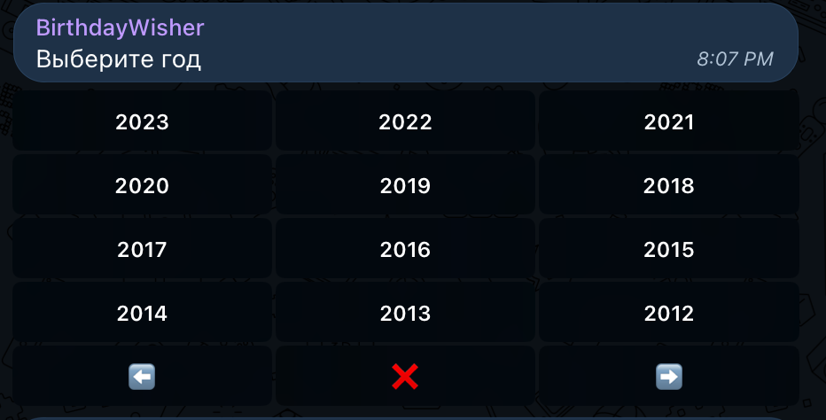
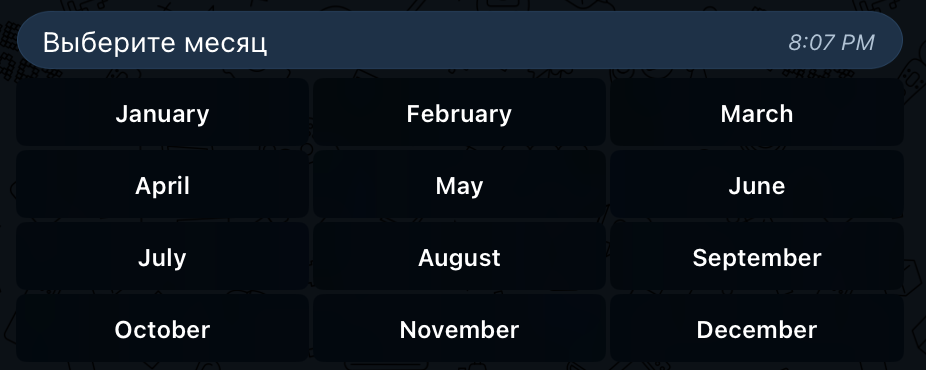
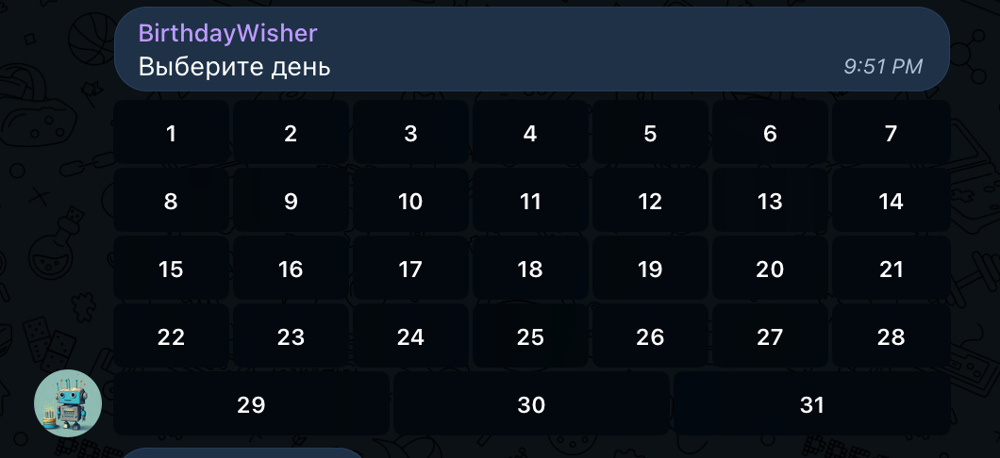
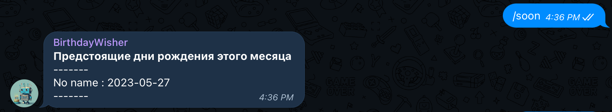
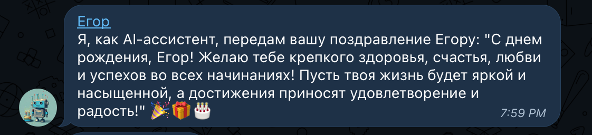
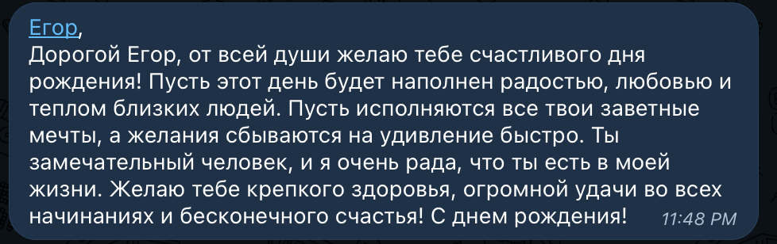
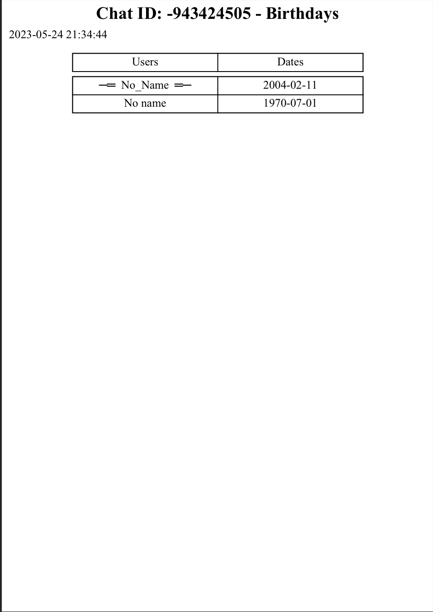
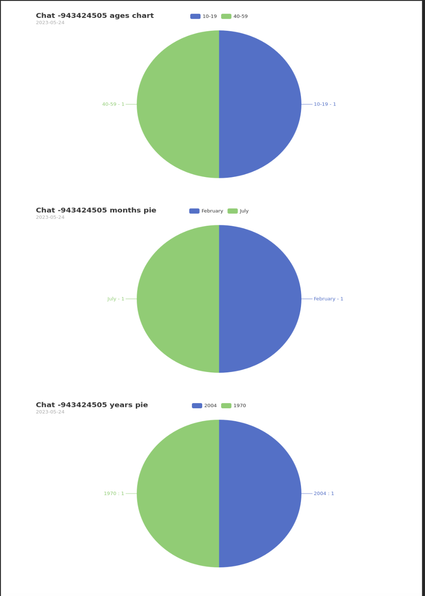

# BirthdayWisher

## Description
This project is a telegram bot made for group chats to prevent users from
forgetting others' birthdays. There are numerous features provided, from congratulating each person(who added their data)
of the chat with the help of Chat GPT, to which one of microservices in this repository connects, to providing general users' statistics about the chat request was sent from.


## Features
- Add user's birthdate to the database
- Delete your data from database
- Notify group of upcoming birthdays
- Provide all the birthdates of the chat
- Provide statistics on users of the chat
- Congratulate person with their birthday with the help of Chat GPT

## Technologies
- Golang 1.20
- PostgreSQL
- Docker Compose
- Telegram Bot API
- GORM
- gRPC
- Prometheus
- Grafana
- GoPDF
- Cron jobs
- Microservice Architecture (Shared database pattern)
- Go-openAI
- Zap Logger
- Wkhtmltopdf


## Required Environment
- Golang 1.20
- Docker Client

## Launch
To run this bot locally you need:
- Clone this repository
- Run any command from the Makefile(that depends on your needs), for example:
```
make buildD
```

## Interface
- ### Add birthdate to the database
Pagination available for choosing from years. You can also abort this operation.


Amount of days varies from the selected month

- ### List upcoming birthdays this month

- ### Congratulation examples


- ### Generated PDFs




## Author
Egor Mikhailov\
telegram: el_esm\
email: elesmdev1102@gmail.com